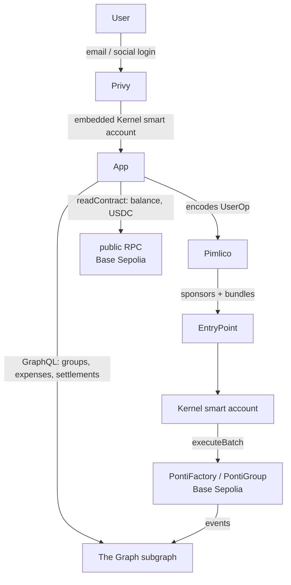

# Ponti

> Settle up, on-chain.

[](https://github.com/aliersh/ponti/actions/workflows/test.yml)
[](contracts/foundry.toml)
[](https://getfoundry.sh)
[](https://sepolia.basescan.org)
[](https://sepolia.basescan.org/address/0x17463e06C303e30044609a9a412d7DB4746Cb210)
[](#license)

<!--
  Badges to add later, when the supporting infrastructure exists:
  - Test coverage, once `forge coverage` is wired into CI (e.g., Codecov)
  - Audit / formal verification badge, if and when an audit is completed
  - Gas snapshot, once a reproducible gas baseline is tracked
-->

Ponti is a non-custodial primitive for shared expenses. Two members deploy a group contract, record expenses against it, and settle the running net balance in USDC directly between their wallets — atomically, on-chain, with no third party in the middle.

This repo is a full-stack monorepo: Solidity contracts (the source of truth), a React app that makes the contract usable by non-crypto users (email/social login, embedded smart account, sponsored gas via ERC-4337), and a The Graph subgraph that serves the reads. Existing trackers like Splitwise handle ledger tracking well, and many now link a payment app to settle — but the ledger and the money stay two systems. Ponti keeps balances and settlement in the same contract, so the payment is the proof.

## Status

M1 (the contract) is deployed and verified on Base Sepolia, `PontiFactory` at [`0x1746…Cb210`](https://sepolia.basescan.org/address/0x17463e06C303e30044609a9a412d7DB4746Cb210). M2 (the onboarding app) is functional end-to-end — create group, add/edit/delete expenses, and settle are all gasless and verified — with a design and UX pass in progress.

<!-- TODO: add screenshot or demo link after the design pass -->

## Architecture



- The contract is the source of truth; any off-chain layer is plumbing on top of a contract that works standalone.
- All writes are sponsored UserOperations submitted through Pimlico; the user never holds ETH.
- Reads split between the subgraph (GraphQL for lists and history) and direct `readContract` calls (balance, USDC balance).
- The contract never holds funds — settlement moves USDC directly from debtor to creditor via `approve` + `safeTransferFrom`.

## Engineering highlights

- **Non-custodial settlement.** The app batches a USDC `approve` for the exact debt and the `settle()` call into a single `executeBatch` UserOp; `settle()` then moves the funds debtor → creditor via `safeTransferFrom`. The allowance is set and consumed atomically in one transaction; there is no standing approval and the contract never holds funds. (`app/src/lib/settle.ts`, `contracts/src/PontiGroup.sol`)
- **Gasless onboarding via ERC-4337.** Email or social login creates a counterfactual Kernel smart account (Privy + `permissionless`). The first write deploys the account on-chain; every write is paymaster-sponsored. Users never manage a seed phrase, hold ETH, or see a gas prompt. (`app/src/providers.tsx`, `app/src/App.tsx`)
- **Dynamic data-source templates in The Graph.** `PontiGroup` contracts are deployed dynamically by the factory, so their addresses are unknown at indexing time. The subgraph uses a static data source for `PontiFactory` that spawns a `PontiGroup` template instance for each new group address on `GroupCreated`. (`subgraph/subgraph.yaml`, `subgraph/src/factory.ts`)
- **Foundry test suite: unit, fuzz, invariant, and fork tests.** `PontiGroup.t.sol` covers unit cases; `PontiGroupInvariant.t.sol` uses a bounded handler to drive random add/edit/delete sequences; `PontiGroup.fork.t.sol` runs against real USDC on a pinned Base Sepolia fork block (skips gracefully when `BASE_SEPOLIA_RPC_URL` is unset). (`contracts/test/`)
- **ABIs generated from Foundry build artifacts.** `pnpm gen:abi` reads `contracts/out/**/*.json` and emits `as const` TypeScript literals, giving viem full literal-type inference. No hand-maintained ABI fragments. (`app/scripts/gen-abi.mjs`)
- **Resilient post-write UX.** After a write, the app waits for the subgraph to index the new block before refreshing. A read failure after a confirmed write is surfaced without masquerading as a write failure. (`app/src/lib/subgraph.ts`)
- **Contracts verified on Basescan.** The deployed `PontiFactory` and `PontiGroup` implementation are source-verified at the linked address.

## Repo layout

| Directory | Contents |
| --- | --- |
| `contracts/` | Solidity contracts, Foundry test suite, deployment scripts |
| `app/` | Vite + React SPA — the M2 onboarding layer |
| `subgraph/` | The Graph subgraph (AssemblyScript mappings, schema, deploy config) |
| `docs/` | Design rationale, contract spec, app spec, subgraph spec |

## How it works

1. Two people deploy a Ponti group together: one smart contract, one address, just for them.
2. Either person can record a shared expense at any time. The contract updates a single net balance. No money moves yet.
3. Expenses can be edited or deleted. The contract recomputes the balance accordingly. A full audit trail is preserved on-chain.
4. When the debtor wants to settle up, they call `settle()`. A single transaction approves exactly the amount owed and moves it from the debtor's wallet to the creditor's wallet, then resets the balance to zero — no standing allowance, and the contract never holds funds.

## Getting started

### Contracts

Ponti is built with [Foundry](https://getfoundry.sh).

```bash
git clone https://github.com/aliersh/ponti.git
cd ponti/contracts
forge install   # fetches the forge-std and openzeppelin-contracts submodules
forge build
forge test
```

Most of the suite (unit, fuzz, and invariant tests) runs with no configuration. The fork tests run against Base Sepolia and read the `BASE_SEPOLIA_RPC_URL` environment variable; set it in a `contracts/.env` file to run them.

### App

```bash
cd ponti/app
pnpm install
pnpm gen:abi   # generates app/src/generated/contracts.ts from Foundry build artifacts
pnpm dev
```

Required environment variables (copy `app/.env.example` to `app/.env`):

| Variable | Where to get it |
| --- | --- |
| `VITE_PRIVY_APP_ID` | [Privy dashboard](https://dashboard.privy.io) — public, safe in client bundle |
| `VITE_SUBGRAPH_URL` | Subgraph Studio deployment URL for the Ponti subgraph |
| `VITE_PIMLICO_SPONSORSHIP_POLICY_ID` | Pimlico dashboard — optional; leave empty if not required by your policy |
| `VITE_RPC_URL` | Optional — overrides the default Base Sepolia public RPC for `readContract` calls |

### Subgraph

Built and deployed with `graph-cli` to Subgraph Studio (`pnpm build` / `pnpm deploy` from `subgraph/`). See [`docs/subgraph-spec.md`](docs/subgraph-spec.md) for the entity schema and query design.

## Documentation

- [`docs/design.md`](docs/design.md): the design and the reasoning behind it
- [`docs/contract-spec.md`](docs/contract-spec.md): the contract's function-by-function specification
- [`docs/app-spec.md`](docs/app-spec.md): the web app specification (flows and integration)
- [`docs/subgraph-spec.md`](docs/subgraph-spec.md): the indexer (The Graph subgraph) specification

## Security

Ponti is deployed to testnet (Base Sepolia) only and has not been audited. **Do not use it with real funds.** The contract is non-custodial by design: it never holds funds, and settlement moves USDC directly between members' wallets. That property has not been independently reviewed.

## Roadmap

Directional, not committed. Everything beyond M1 is exploratory and may change, be reordered, or be dropped.

| Milestone | Theme                                                              | Status                  |
| --------- | ------------------------------------------------------------------ | ----------------------- |
| **M1**    | Two-party non-custodial IOU contract                               | Deployed (Base Sepolia) |
| **M2**    | Onboarding: embedded smart-account auth, gasless UX, on Base Sepolia — functional + polished | In progress |
| **M3**    | Multi-party groups and debt-graph simplification                   | Exploratory             |
| **M4**    | Off-chain integration: bank-feed ingestion, auto-classification    | Speculative             |

See [`docs/design.md`](docs/design.md) for the reasoning behind the milestone ordering.

## About

Built by [Ariel Diaz](https://github.com/aliersh).

## License

MIT
